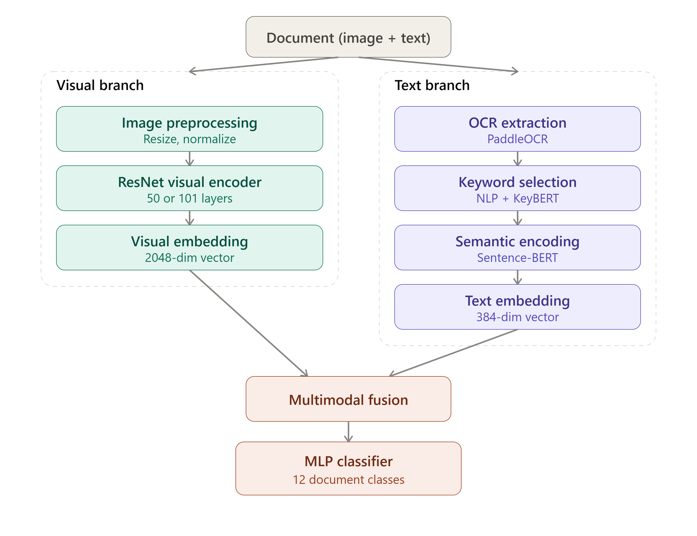

# Multimodal Document Classification

A deep learning pipeline for classifying visually similar documents by combining **visual** and **textual** information — built during a professional internship in an AI/Computer Vision company.

> ⚠️ **Confidentiality notice**
> Due to a confidentiality agreement, the **source code**, **trained model weights**, and **dataset** cannot be shared publicly. This repository documents the **methodology, architecture, and approach** only.

---

## Context

Classifying documents automatically becomes difficult when several categories share a very similar visual layout (e.g. different types of invoices or medical prescriptions). Relying on the document image alone is often not enough — the textual content carries information that can resolve the ambiguity.

This project builds a pipeline that combines both signals to classify documents into **12 categories**.

## Architecture

The pipeline has two parallel branches that are fused before classification:

**Visual branch**
- Image preprocessing (resize, normalization)
- Feature extraction with a ResNet encoder (ResNet50 / ResNet101)
- 2048-dimensional visual embedding

**Text branch**
- Text extraction with PaddleOCR
- Keyword selection (NLP + KeyBERT)
- Semantic encoding with Sentence-BERT
- 384-dimensional text embedding

**Fusion & classification**
- The two embeddings are concatenated (2432-dim)
- A Multi-Layer Perceptron (MLP) classifies the fused vector into one of 12 document classes

## Results

Different configurations were compared to study the trade-off between accuracy and inference cost. The table below shows the accuracy improvement on the hardest classes between an early and a later iteration of the pipeline:

| Class                    | Early version | Improved version |
|---------------------------|:---:|:---:|
| Note d'honoraire           | 92.0% | 95.2% |
| Ordonnance médicaments     | 75.2% | 91.7% |
| BS recto                   | 99.8% | 97.6% |

The biggest gain was on the most visually ambiguous class, confirming that adding textual information meaningfully improves classification where image features alone fall short.

## Key challenges addressed

- Documents with nearly identical visual layouts but different textual content
- OCR errors and incomplete text extraction
- Trade-off between classification accuracy and inference cost
- GPU memory management when running multiple pretrained encoders simultaneously

## Tech stack

`Python` · `PyTorch` · `PaddleOCR` · `Sentence-Transformers` · `KeyBERT` · `ResNet (torchvision)`

## What this repository contains

- ✅ Architecture documentation and diagrams
- ✅ Methodology and design decisions
- ✅ Aggregated results and comparisons
- ❌ Source code (confidential)
- ❌ Dataset (confidential)
- ❌ Trained model weights (confidential)

## Future improvements

- Explore more advanced multimodal fusion strategies (attention-based fusion instead of simple concatenation)
- Improve OCR robustness on handwritten or low-quality documents
- Optimize inference for real-time / production use
- Expand and diversify the training dataset to improve generalization

## About

This project was carried out as part of a summer internship focused on applying deep learning to a real-world document automation problem.

**Author:** Eya Ayedi — Telecommunications Engineering student, Sup'Com Tunis
Focus: Artificial Intelligence, Machine Learning, Deep Learning

Feel free to connect or reach out if you have questions about the approach!
